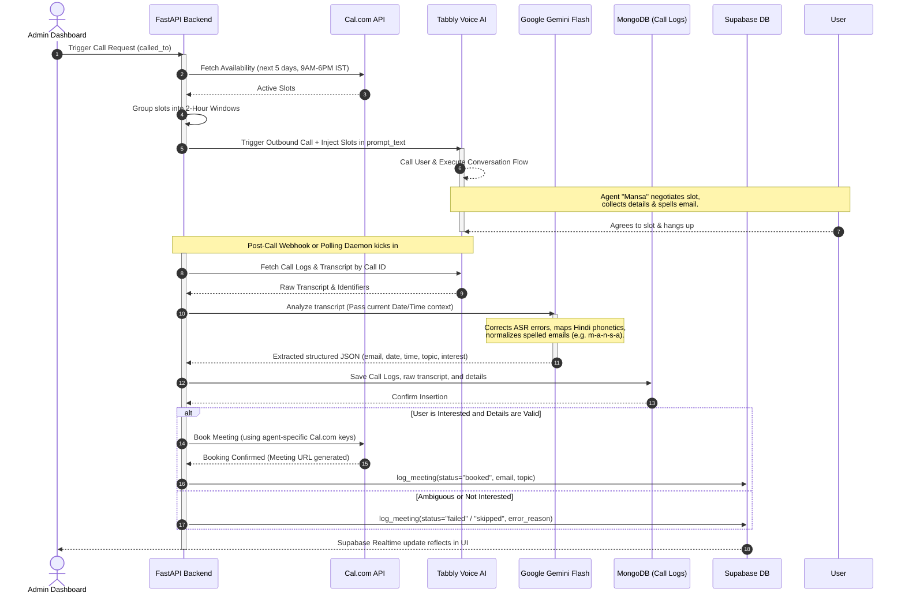

# 🎙️ Mansa Voice AI Dashboard

> **Advanced Outbound Calling & Smart Automated Scheduling Platform**
> Unified React + FastAPI application empowering time-aware conversational AI agents with automated Cal.com booking and Gemini-powered post-call intelligence.

---

## 📌 Table of Contents
1. [⚙️ Tech Stack](#️-tech-stack)
2. [🏗️ Project Flow & Architecture](#️-project-flow--architecture)
3. [🚀 Key Features](#-key-features)
4. [🔌 API Reference](#-api-reference)
5. [🗄️ Database Schema](#️-database-schema)
6. [🛠️ Local Development & Setup](#️-local-development--setup)
7. [📦 Deployment](#-deployment)
8. [❓ Questions for Further Alignment](#-questions-for-further-alignment)

---

## ⚙️ Tech Stack

The platform is designed with a high-performance, dual-database architecture separating transactional state, real-time auth, analytical call logging, and external AI orchestrations.

### 💻 Frontend
* **Core Framework:** React 19.x & TypeScript (tsconfig, tsconfig.node configurations)
* **Build Tool:** Vite 8.x
* **Styling & Icons:** Tailwind CSS 3.x & Lucide React
* **State Management:** Zustand 5.x (lightweight, decoupled global state store)
* **Routing & Alerts:** React Router DOM 7.x & React Hot Toast
* **Data Visuals & Sheet Operations:** xlsx (Excel logs exporter) & Axios client interceptors

### ⚙️ Backend
* **Core Framework:** FastAPI (Python 3.10+)
* **Server Engines:** Uvicorn (Development) & Gunicorn (Production multi-worker stability)
* **Security & Routing:** FastAPI CORSMiddleware, HTTPBearer security filters
* **HTTP Orchestration:** Requests (Tabbly/Cal.com integrations) & python-dotenv configuration

### 🗄️ Databases & Services
* **Transactional DB & Real-time Auth:** Supabase (PostgreSQL)
  * Powers user authentication (Supabase JWT verified in backend middleware).
  * Stores agent-to-user routing configurations and transaction logs.
* **Analytical Storage:** MongoDB (`calling_agent_db`)
  * Stores comprehensive raw call transcripts, phone records, and raw JSON outputs from the telephony platform.
* **Voice AI Platform:** Tabbly.io
  * Handles telephony, text-to-speech, speech-to-text, and real-time execution of the agent prompt.
* **Calendar Scheduling:** Cal.com (v2 bookings & slots API)
  * Used for dynamic slot checking and seamless scheduled consultation bookings.
* **Large Language Model (AI Extractor):** Google Gemini Flash (`gemini-flash-latest`)
  * Analyzes complex, multilingual, and noisy transcripts for robust detail extraction.

---

## 🏗️ Project Flow & Architecture

The following sequence diagram outlines the end-to-end data flow from triggering a call to final scheduling and logging:



---

## 🚀 Key Features

1. **Dynamic Time-Aware Outbound Dialing**
   * Before triggering an outbound call, the backend queries Cal.com dynamically.
   * Available slots are grouped into 2-hour windows (e.g., 9 AM to 11 AM) and injected into the agent's custom instruction context.
   * This guarantees that the voice agent never offers a slot that has already been booked or is in the past.

2. **Error-Resilient AI Transcript Extractor (Gemini Powered)**
   * Built-in intelligent prompt structure inside `post_call_service.py` to process noisy transcripts.
   * **Phonetic Normalization:** Converts multi-lingual audio artifacts (e.g. "विमल" to "vimal", "manta infotech" to "mansainfotech").
   * **Smart Email Reconstruction:** Combines multiple failed spoken email attempts, resolves spelling characters (e.g., "m-a-n-s-a at gmail dot com"), and eliminates spaces.
   * **Date Resolution:** Concretizes relative timelines (like "tomorrow" or "next Monday") into valid ISO-8601 UTC formats based on timezone-aware calendars.

3. **Decoupled User-Agent Mapping System**
   * Supabase acts as a route registrar. The system allows different voice agents to be mapped to individual users.
   * Agents can be customized with their own Cal.com API keys and `eventTypeId` values, supporting multi-tenant schedules.

4. **Integrated Unified Single-Port Hosting**
   * Static production assets from the React frontend (`frontend/dist`) are mounted directly inside the FastAPI server.
   * Includes catch-all routes supporting client-side routers (React Router) without web server configuration, making it highly portable.

5. **Campaign Scheduler**
   * Enables orchestrating automated voice campaigns over predefined time windows, time zones, and personalized introductory dialogues.

---

## 🔌 API Reference

### 1. Internal FastAPI Endpoints (Prefixed with `/api`)

| Method | Endpoint | Description | Auth Requirement |
| :--- | :--- | :--- | :--- |
| **GET** | `/api/agents` | Lists all Tabbly agents mapped to the authenticated user. | Bearer Supabase JWT |
| **POST** | `/api/agents` | Creates a new Voice AI Agent on Tabbly and maps it in Supabase. | Bearer Supabase JWT |
| **DELETE** | `/api/agents/{id}` | Deletes the Tabbly agent and removes mapping records. | Bearer Supabase JWT |
| **POST** | `/api/calls/trigger` | Pre-fetches Cal.com slots, injects availability, and fires outbound call. | Bearer Supabase JWT |
| **GET** | `/api/logs/call-logs` | Retrieves full call logging history from Tabbly/MongoDB. | Bearer Supabase JWT |
| **GET** | `/api/logs/stats` | Calculates performance statistics (call counts, booked percentages). | Bearer Supabase JWT |
| **POST** | `/api/campaigns` | Configures and queues outbound calling campaigns. | Bearer Supabase JWT |
| **POST** | `/api/webhooks/tabbly` | Receive real-time call completions from Tabbly to initiate booking workflows. | Public / Hook Token |

### 2. External Integration Endpoints

* **Tabbly.io APIs:**
  * `POST https://www.tabbly.io/api/create-agent`
  * `POST https://www.tabbly.io/api/get-agents`
  * `POST https://www.tabbly.io/dashboard/agents/endpoints/trigger-call`
  * `GET https://www.tabbly.io/dashboard/agents/endpoints/call-logs-v2`
* **Cal.com APIs:**
  * `GET https://api.cal.com/v2/slots/available` — Pre-fetch available windows
  * `POST https://api.cal.com/v2/bookings` — Request a scheduled consultation

---

## 🗄️ Database Schema

### 1. Supabase (PostgreSQL Schema)

#### Table: `profiles`
Tracks user credentials and default booking details.
```sql
CREATE TABLE profiles (
    id UUID PRIMARY KEY REFERENCES auth.users(id) ON DELETE CASCADE,
    email TEXT UNIQUE NOT NULL,
    cal_api_key TEXT,
    cal_event_type_id TEXT,
    created_at TIMESTAMPTZ DEFAULT now()
);
```

#### Table: `agent_mappings`
Maps Tabbly voice agents to specific workspace owners.
```sql
CREATE TABLE agent_mappings (
    id BIGSERIAL PRIMARY KEY,
    agent_id TEXT UNIQUE NOT NULL, -- Tabbly Agent ID
    user_id UUID REFERENCES auth.users(id) ON DELETE CASCADE,
    cal_api_key TEXT,
    cal_event_type_id TEXT,
    meeting_enabled BOOLEAN DEFAULT true,
    created_at TIMESTAMPTZ DEFAULT now()
);
```

#### Table: `meeting_logs`
Logs outcome tracking for booked calendar meetings.
```sql
CREATE TABLE meeting_logs (
    id BIGSERIAL PRIMARY KEY,
    user_id UUID REFERENCES auth.users(id) ON DELETE CASCADE,
    agent_id TEXT NOT NULL,
    call_id TEXT NOT NULL,
    status TEXT NOT NULL,          -- 'booked', 'failed', 'skipped'
    extracted_email TEXT,
    meeting_topic TEXT,
    is_interested BOOLEAN,
    error_reason TEXT,
    created_at TIMESTAMPTZ DEFAULT now()
);
```

---

### 2. MongoDB Schema (Collections: `call_logs`)

Call logs are preserved in MongoDB as analytical document nodes. A standard item maps to the following document structure:

```json
{
  "_id": "ObjectId('...')",
  "participant_identity": "Tabbly_Call_UUID",
  "phone_number": "91XXXXXXXXXX",
  "user_name": "Full Name",
  "user_email": "reconstructed_email@domain.com",
  "transcript": "Full text of the conversation with agent...",
  "raw_json_output": "Stringified raw JSON output generated by Tabbly...",
  "meeting_start_time": "2026-05-27T04:30:00.000Z",
  "meeting_notes": "Meeting Topic Details \n\nSummary: Summary of user requirements...",
  "interested": true,
  "call_date": "2026-05-26",
  "call_time": "14:58:00",
  "created_at": "2026-05-26T14:58:48.000Z"
}
```

---

## 🛠️ Local Development & Setup

### Prerequisites
* Python 3.10 or higher installed
* Node.js v20.x or higher installed with `npm`
* Access credentials for:
  * Supabase URL & Anon Key
  * Tabbly.io Organization & API Key
  * Google Gemini API Key
  * Cal.com Account Key
  * MongoDB Cluster connection URI

---

### 1. Backend Setup
1. Navigate to the backend directory:
   ```bash
   cd backend
   ```
2. Create and activate a virtual environment:
   ```bash
   python3 -m venv venv
   source venv/bin/activate
   ```
3. Install backend dependencies:
   ```bash
   pip install -r requirements.txt
   ```
4. Copy the environment variables template and configure it:
   ```bash
   cp .env.example .env
   ```
5. Run the FastAPI development server:
   ```bash
   uvicorn main:app --reload --port 8000
   ```

#### Backend `.env` Variable Descriptions:
```ini
TABBLY_API_KEY=your_tabbly_api_key
TABBLY_ORG_ID=your_tabbly_org_id
TABBLY_CALL_FROM_NUMBER=telephony_outbound_caller_number
TABBLY_AGENT_ID=default_fallback_agent_id
TABBLY_PHONE_NUMBER=target_dial_number_for_scripts
CAL_API_KEY=your_cal_com_api_key
CAL_EVENT_TYPE_ID=your_default_cal_event_type_id
GEMINI_API_KEY=your_gemini_api_key
MONGODB_URI=your_mongodb_connection_uri
SUPABASE_URL=your_supabase_url
SUPABASE_ANON_KEY=your_supabase_anon_key
```

---

### 2. Frontend Setup
1. Navigate to the frontend directory:
   ```bash
   cd frontend
   ```
2. Install frontend dependencies:
   ```bash
   npm install
   ```
3. Copy environment variables and populate:
   ```bash
   cp .env.example .env
   ```
4. Run the Vite developer bundle:
   ```bash
   npm run dev
   ```

#### Frontend `.env` Variable Descriptions:
```ini
VITE_SUPABASE_URL=your_supabase_url
VITE_SUPABASE_ANON_KEY=your_supabase_anon_key
```

---

## 📦 Deployment

### 1. Unified Shell Script Build (`build.sh`)
This script prepares the React frontend static dist package, places it in the backend's directory, and installs the required Python dependencies in a single shot:
```bash
./build.sh
```

### 2. Multi-Stage Dockerfile Deployment
The root directory includes a production-ready `Dockerfile` split into two stages:
* **Stage 1 (Frontend Builder):** Installs Node packages, copies React files, and outputs the production bundle `dist`.
* **Stage 2 (FastAPI Production Server):** Copies built frontend artifacts into Python's workspace, installs FastAPI packages, and mounts Gunicorn to handle production workloads.

To build and run:
```bash
docker build -t mansa-voice-dashboard .
docker run -p 8000:8000 -e PORT=8000 --env-file ./backend/.env mansa-voice-dashboard
```

### 3. Render Deployment (`render.yaml`)
A declaration file for Render is included in the project root. It coordinates setup requirements, maps required environment variables, and deploys using the dynamic Docker runtime:
* **Build Command:** Built automatically via Dockerfile execution.
* **Service Type:** Web Service running on the Free Plan in the Oregon region.

---

## ❓ Questions for Further Alignment

To help tailor this workspace further, we have gathered a few structural questions. Let's align on these as we build additional features:

1. **Supabase Schema Modifications:** Have you already run the migrations to add the personalized `cal_api_key` and `cal_event_type_id` columns to your database's `agent_mappings` table, or would you like a migration script written for it?
2. **MongoDB Connection Target:** Are there any local or staging MongoDB database credentials we should configure to run immediate integration tests, or do you prefer using mockup interfaces?
3. **Telephony Hooks:** Would you like us to configure the live Tabbly webhook router endpoints inside `routers/webhooks.py` to trigger post-call workflows instantly, or do you prefer the proactive polling method?
4. **Analytics Focus:** Do you have specific graphs, funnels, or KPI targets you'd like to display on your dashboard home page?
